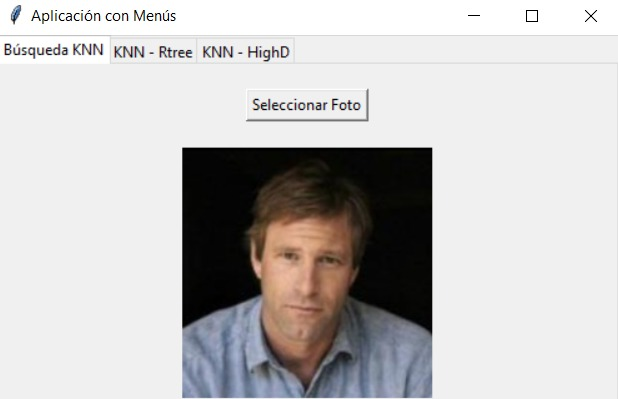
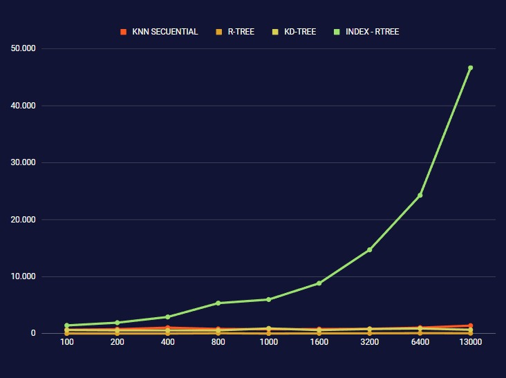
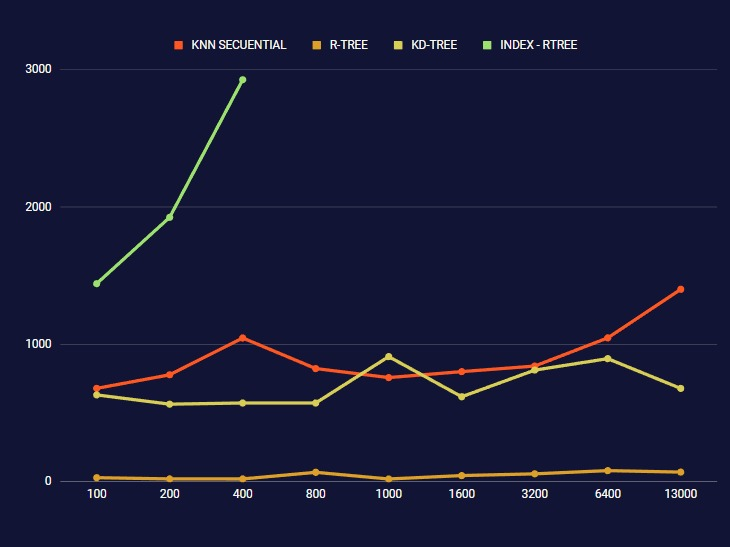

# Aplicación de Búsqueda KNN en Imágenes

Esta es una aplicación de búsqueda KNN (K-Nearest Neighbors) que utiliza la biblioteca `face_recognition` para calcular la similitud entre imágenes faciales. La aplicación muestra una imagen de entrada y busca las imágenes más similares en una base de datos de imágenes faciales.

## Requisitos

Para ejecutar la aplicación, se requiere tener instaladas las siguientes bibliotecas de Python:

- `tkinter`: Para la interfaz gráfica de usuario.
- `Pillow`: Para el manejo de imágenes.
- `face_recognition`: Para el reconocimiento facial.
- `numpy`: Para el manejo de matrices y vectores.
- `heapq`: Para la creación de una cola de prioridad.
- `rtree`: Para la indexación de datos utilizando el algoritmo R-tree.
- `scipy`: Para el manejo de estructuras de datos espaciales, como KDTree.
  
Puedes instalar estas bibliotecas utilizando el administrador de paquetes `pip`. Por ejemplo:

- pip install `tkinter`.
- pip install `Pillow`.
- pip install `face_recognition`.
- pip install `numpy`.
- pip install `heapq`.
- pip install `Rtree`.
- pip install `scipy`.

## Uso

1. Ejecuta el archivo `app.py` para iniciar la aplicación.
2. Aparecerá una ventana con pestañas.
3. En la pestaña "Búsqueda KNN", presiona el botón "Seleccionar Foto" para elegir una imagen.
4. La aplicación calculará la similitud entre la imagen seleccionada y las imágenes de la base de datos.
5. Se mostrará una vista previa de la imagen seleccionada y las imágenes más similares en una cuadrícula.
6. Puedes cambiar a las pestañas "KNN - Rtree" y "KNN - HighD" para probar otros métodos de búsqueda KNN utilizando R-tree y KDTree, respectivamente.

## Estructura del Código

El código se organiza de la siguiente manera:

- `app.py`: El archivo principal que contiene la interfaz gráfica de usuario y la lógica de la aplicación.

El archivo `app.py` contiene las siguientes funciones principales:

### `obtener_vector(file_path)`

Esta función recibe la ruta de un archivo de imagen y utiliza la biblioteca `face_recognition` para extraer el vector característico de la imagen facial. Devuelve el vector característico.

### `choose_file()`

Esta función se ejecuta cuando se presiona el botón "Seleccionar Foto" en la pestaña "Búsqueda KNN". Abre un cuadro de diálogo para seleccionar una imagen y luego llama a la función `process_file()` para procesar la imagen seleccionada.

### `process_file(file_path)`

Esta función carga los datos de vectores característicos y nombres de la base de datos. Luego, calcula la similitud entre la imagen seleccionada y las imágenes de la base de datos utilizando la distancia euclidiana en el espacio de características. Ordena los resultados por similitud y muestra las imágenes más similares en una cuadrícula junto con la vista previa de la imagen seleccionada.

### `choose_file_rtree()`

Esta función se ejecuta cuando se presiona el botón "Seleccionar Foto" en la pestaña "KNN - Rtree". Abre un cuadro de diálogo para seleccionar una imagen y luego llama a la función `process_file_rtree()` para procesar la imagen seleccionada.

### `process_file_rtree(file_path)`

Esta función carga los datos de vectores característicos y nombres de la base de datos. Luego, crea un índice R-tree utilizando la biblioteca `rtree` si el índice no se ha creado previamente. Utiliza el índice para encontrar los vecinos más cercanos de la imagen seleccionada y muestra las imágenes correspondientes en una cuadrícula junto con la vista previa de la imagen seleccionada.

### `choose_file_kdtree()`

Esta función se ejecuta cuando se presiona el botón "Seleccionar Foto" en la pestaña "KNN - HighD". Abre un cuadro de diálogo para seleccionar una imagen y luego llama a la función `process_file_kdtree()` para procesar la imagen seleccionada.

### `process_file_kdtree(file_path)`

Esta función carga los datos de vectores característicos y nombres de la base de datos. Luego, crea un KDTree utilizando la biblioteca `scipy` y utiliza el árbol para encontrar los vecinos más cercanos de la imagen seleccionada. Muestra las imágenes correspondientes en una cuadrícula junto con la vista previa de la imagen seleccionada.

## Algoritmos Implementados

### KNN Secuencial

El algoritmo KNN secuencial realiza una búsqueda exhaustiva de los vecinos más cercanos comparando la imagen de entrada con todas las imágenes de la base de datos. A continuación, se presentan las ventajas y desventajas de este enfoque:

#### Ventajas:
- Implementación simple y fácil de entender.
- Funciona bien para conjuntos de datos pequeños.
- No requiere estructuras de datos adicionales.

#### Desventajas:
- Requiere un tiempo considerable para buscar en grandes conjuntos de datos, ya que se deben calcular las distancias entre la imagen de entrada y todas las imágenes de la base de datos.
- No escala eficientemente con un aumento en el tamaño de la base de datos.
- No aprovecha la estructura espacial de los datos, lo que puede resultar en una búsqueda lenta.

### R-tree

El R-tree es una estructura de datos especializada para la búsqueda de vecinos más cercanos y consultas de rango en datos espaciales. A continuación, se presentan las ventajas y desventajas del uso de R-tree:

#### Ventajas:
- Permite una búsqueda eficiente de vecinos más cercanos y consultas de rango en datos espaciales.
- Mejora significativamente el rendimiento en comparación con el enfoque secuencial para grandes conjuntos de datos.
- Organiza los datos en una estructura de árbol que permite una búsqueda rápida y reduce la cantidad de comparaciones necesarias.

#### Desventajas:
- Requiere tiempo y recursos adicionales para construir la estructura de índice inicial.
- El rendimiento puede verse afectado si los datos cambian con frecuencia y se requiere una reconstrucción frecuente del índice.
- El uso eficiente de R-tree depende de una adecuada selección de parámetros y ajuste de configuraciones.

### KD-tree

El KD-tree (árbol k-dimensional) es una estructura de datos jerárquica que divide el espacio multidimensional en regiones para facilitar la búsqueda de vecinos más cercanos. A continuación, se presentan las ventajas y desventajas del uso de KD-tree:

#### Ventajas:
- Permite una búsqueda eficiente de vecinos más cercanos en espacios de alta dimensión.
- Reduce el número de comparaciones necesarias al dividir recursivamente el espacio en regiones.
- Puede manejar grandes conjuntos de datos y consultas de vecinos más cercanos rápidamente.

#### Desventajas:
- La construcción inicial del árbol puede llevar tiempo, especialmente para conjuntos de datos grandes.
- El rendimiento puede verse afectado si los datos cambian con frecuencia y se requiere una reconstrucción frecuente del árbol.
- No funciona bien con espacios de alta dimensionalidad debido a la "maldición de la dimensionalidad".

## Análisis de la Maldición de la Dimensionalidad

La "maldición de la dimensionalidad" es un fenómeno en el que la eficiencia de los algoritmos de búsqueda de vecinos más cercanos disminuye a medida que aumenta la dimensionalidad de los datos. Para mitigar este problema, se pueden considerar los siguientes enfoques:

- Reducción de dimensionalidad: Utilizar técnicas como PCA (Análisis de Componentes Principales) o LDA (Análisis Discriminante Lineal) para reducir la dimensionalidad de los datos sin perder demasiada información.
- Selección de características: Identificar las características más relevantes y descriptivas para el problema en cuestión y trabajar con un subconjunto reducido de características.
- Uso de técnicas de búsqueda aproximada: Emplear algoritmos que proporcionen soluciones aproximadas más rápidas, como LSH (Local Sensitive Hashing).

Es importante tener en cuenta que la elección del algoritmo y las técnicas de mitigación de la maldición de la dimensionalidad dependen del conjunto de datos y del contexto específico del problema.

## PCA (Análisis de Componentes Principales)
El PCA es una técnica ampliamente utilizada para reducir la dimensionalidad de los datos al encontrar las direcciones principales en las que los datos tienen la mayor varianza. Su objetivo es encontrar una representación más compacta y significativa de los datos al proyectarlos en un nuevo sistema de coordenadas.

### Pasos para realizar el PCA:

- Normalización de los datos: Los datos se escalan para asegurar que todas las características tengan una escala comparable.
- Cálculo de la matriz de covarianza: Se calcula la matriz de covarianza para determinar las relaciones entre las diferentes características de los datos.
- Cálculo de los autovectores y autovalores: Se calculan los autovectores y autovalores de la matriz de covarianza. Los autovectores representan las direcciones principales y los autovalores indican la importancia de estas direcciones en términos de la varianza de los datos.
- Selección de componentes principales: Se seleccionan las componentes principales en función de los autovalores, comenzando por las que tienen los autovalores más grandes.
- Proyección de los datos: Los datos se proyectan en el espacio de las componentes principales seleccionadas para obtener una representación reducida de los datos.
- El PCA es útil para reducir la dimensionalidad de los datos al eliminar las correlaciones entre las características y capturar la mayor cantidad de información posible en un número reducido de componentes principales.

## LDA (Análisis Discriminante Lineal)
- El LDA es una técnica utilizada para encontrar las características que mejor discriminan entre diferentes clases o categorías en los datos. A diferencia del PCA, el LDA tiene en cuenta la información de las etiquetas o clases asociadas a los datos.

### Pasos para realizar el LDA:

- Cálculo de las matrices de dispersión: Se calculan las matrices de dispersión entre clases y dentro de clases. La matriz de dispersión entre clases captura las diferencias entre las clases, mientras que la matriz de dispersión dentro de clases captura la variabilidad dentro de cada clase.
- Cálculo de los autovectores y autovalores: Se calculan los autovectores y autovalores de la matriz resultante de la multiplicación de la matriz de dispersión dentro de clases inversa por la matriz de dispersión entre clases. Los autovectores representan las direcciones discriminantes y los autovalores indican su importancia.
- Selección de las características discriminantes: Se seleccionan las características correspondientes a los autovectores con los autovalores más grandes como las dimensiones discriminantes.
- Proyección de los datos: Los datos se proyectan en el espacio de las características discriminantes seleccionadas para obtener una representación reducida que maximiza la discriminación entre las clases.
- El LDA es útil cuando se busca reducir la dimensionalidad de los datos mientras se mantiene la información que mejor discrimina entre las clases.

Ambos métodos, PCA y LDA, son técnicas poderosas para reducir la dimensionalidad de los datos. El PCA es más adecuado cuando no hay información de etiquetas o se busca una representación compacta de los datos sin tener en cuenta las clases. Por otro lado, el LDA es más adecuado cuando se desea maximizar la discriminación entre clases y se dispone de información de etiquetas. La elección entre ambos métodos dependerá del contexto y el objetivo específico del análisis.

## Experimentación

Se realizaron experimentos para evaluar el rendimiento y la eficacia de los diferentes algoritmos en la búsqueda de vecinos más cercanos en datos de imágenes faciales. Los resultados se resumen en las siguientes tablas y gráficos:

En el primer análisis podemos ver los tiempos de los 3 métodos de búsqueda, ademas del tiempo de indexación del R-Tree.

En el segundo análisis podemos ver solo los tiempos de los 3 métodos de búsqueda.

## Conclusiones

- El enfoque secuencial es simple pero ineficiente para conjuntos de datos grandes y consultas frecuentes.
- R-tree y KD-tree mejoran el rendimiento y la eficacia de la búsqueda de vecinos más cercanos.
- R-tree es especialmente útil en consultas de rango y datos espaciales.
- KD-tree funciona bien en espacios de alta dimensión, pero puede verse afectado por la maldición de la dimensionalidad.
- La elección del algoritmo depende de la naturaleza del problema, el tamaño del conjunto de datos y las características específicas de los datos.

## Contribución

Si deseas contribuir a este proyecto, puedes hacerlo de las siguientes maneras:

- Reportando problemas o errores.
- Sugiriendo nuevas características o mejoras.
- Enviando solicitudes de extracción para corregir problemas o agregar funcionalidades.

¡Espero que esta aplicación sea útil y te diviertas explorando las imágenes similares!
